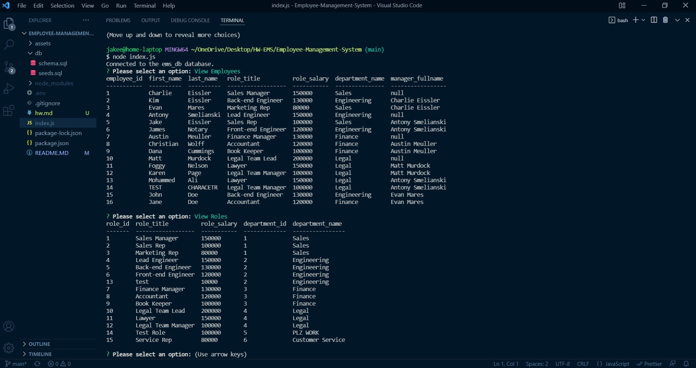

# Employee Management System

# Description

This command line application will allow the user to manage all of their employees and departments by enabling them to dynamically update the tables using inquirer and mysql.

[Walkthrough Video](https://drive.google.com/file/d/1e1iyqXoprzdEF-BSpSl16OGMWCDAKlCc/view)

# Table of Contents

[Installation](#instructions)

[Usage](#usage)

[Contributing](#contributing)

[Tests](#tests)

[Questions](#questions)

[License](#license)

# Installation

Clone the repository to your local machine and run npm i to install the dependencies associated and then run node index.js in the command line to begin the application.

# Usage

This app is used to update and keep track of employee and department records.

# Contributing

I am the sole contributor.

# Tests

No testing was done in the creation of this app.

# Questions

My Github username is jakeeis24

Link to my Github profile: https://github.com/jakeeis24

Questions? Email me: jakeeissler1@gmail.com

# License

No license associated with this repository.
